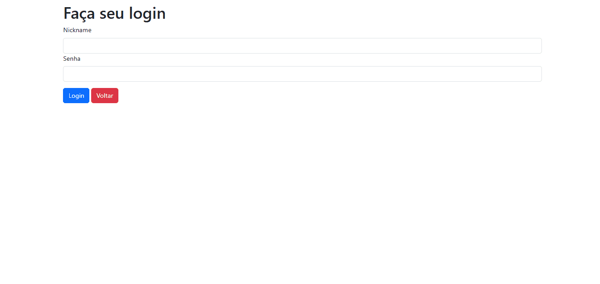

# 📚🎮 Jogoteca - Biblioteca de Jogos
## Sistema web com autenticação e gerenciamento de jogos usando Flask

## 📝 Descrição do projeto:
A Jogoteca é uma aplicação web desenvolvida com o framework Flask que simula o sistema de uma biblioteca de jogos. Com ela, é possível cadastrar, editar, visualizar e remover jogos, além de contar com um sistema completo de autenticação de usuários com controle de sessão e proteção de rotas.

O projeto foi desenvolvido durante o curso "Flask: Avançando no desenvolvimento web com Python", da Alura, com o objetivo de aplicar conceitos avançados do desenvolvimento web com foco em boas práticas, estrutura de código limpa e segurança.

A aplicação integra front-end e back-end de forma fluida, utilizando WTForms para validação de formulários e SQLAlchemy para manipulação do banco de dados.
## 🚀 Tecnologias usadas:
      
 
## ⚙ Funcionalidades:
- ✅ Autenticação de usuários;
- ✅ Login com proteção de rotas;
- ✅ CRUD de jogos (criar, listar, editar e deletar);
- ✅ Interface intuitiva;
- ✅ Validações de formulários com WTForms;
- ✅ Upload de imagens.

## 📚 Principais aprendizados:
Este projeto foi uma oportunidade de consolidar habilidades essenciais para o desenvolvimento web. Mais do que construir uma aplicação funcional, o foco esteve em entender os bastidores do que faz uma aplicação segura, escalável e bem estruturada. Com ele, consegui compreender:
- 📌 A importância de separar responsabilidades entre arquivos, para tornar o código mais limpo e organizado;
- 📌 O funcionamento por trás do login de usuários, sessões e proteção de rotas;
- 📌 A importância da experiência do usuário, garantindo feedbacks claros e prevenindo falhas;
- 📌 O trabalho com banco de dados via SQLAlchemy, mapeando modelos e entendendo relações.

## 🖼 Demonstração do projeto:

## 👩‍💻 Autora:

[ Nathália Anastácio](https://github.com/nath-anastacio)

### 💬 Você pode me encontrar em:

  
  

